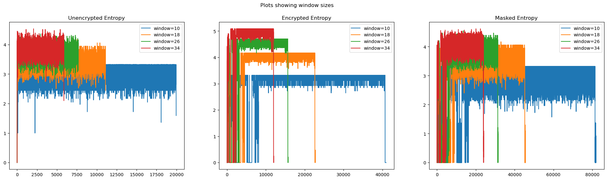
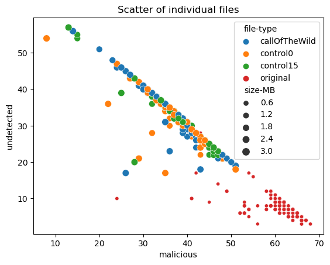
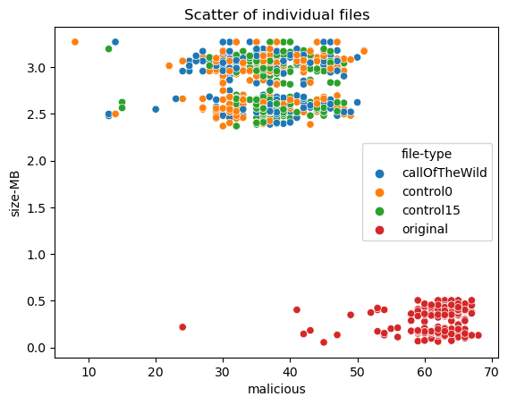

# AEDEV: Anti-Entropy Detection for Encrypted Viruses

## Background

Meta-morphic viruses are really difficult to detect and classify because they employ a heavy amount of obfuscation that hides the actual intent of the code being run. Furthermore, this obfuscation keeps changing so it's difficult to identify patterns that could be used to detect and classify metamorphic viruses. However, all that obfuscation does have a predictable and consistent impact on the virus file. Obfuscation can consistently and reliably increases the entropy of the file. Based on this, an analysis centered on the entropy of a virus file might have a better chance of detecting and classifying the file, than an analysis centered on opp code analysis. This was the basis for a [2013 paper](https://link.springer.com/article/10.1007/s11416-013-0185-4) that found that focusing the analysis around the structural entropy of a file yielded strong results in certain challenging cases.

## The Idea

If entropy analysis is the Achilles's heel for metamorphic viruses then my CS-180H project is focused on figuring out a way to protect that Achilles's heel. The general goal of the project is to figure out a way to somehow make the entropy structure of a virus file look like the entropy structure of a benign file. The primary technique I used to achieve this effect was padding. Over the course of the project, I experimented with 2 different padding strategies to make the entropy structure of a virus file look like the entropy structure of a benign file.

### Strategy 1: Byte padding (fails eventually)

This strategy involved inserting extra bytes in between the bytes of the virus file. The two tunable factors I considered in this strategy were

1. `How frequently to insert a byte` or `By how much to inflate the file with padding bytes` and
2. `What byte value should be inserted`

For the first tuning factor, I decided to insert a byte after every byte of the virus file. This would inflate the virus file to be twice its original size. If this worked to reduce the entropy then I would progressively deflate the mask by inserting a byte after every second, third, fourth byte and so on.

For the second tuning factor, I decided to use an n-gram probability to make a probabilistic choice on the value of every padding byte that I inserted. I tried using a 1-gram and 2-gram probability and found that in general, a 2-gram probability mask did a better job at lowering the entropy of the virus file than the 1-gram probability mask.

Despite the success of this **Byte Padding** strategy, I discovered a fatal flaw in it. Every byte in any file can have one of 256 different values. To apply a 1-gram probability mask on a virus file I would look at a byte *x* from the virus file, and make a probabilistic prediction such that given a byte value *x* what is the next likely byte after *x* in a reference benign file? This would work only if there was at least one occurrence of *x* in the reference benign file. The strategy would completely fail if there was no occurrence of *x* in the reference benign file. The guiding heuristic that I set for myself in this project was to make a virus file look like an ordinary English text file. Such a text file is likely to be filled with bytes of values ranging from 32 - 126, ie. ascii values of alphanumeric characters and some special symbols. This leaves 162 different byte values that can break the **Byte Padding** strategy by occurring only once in the virus file to be masked. Also given the high entropy in the virus files I was trying to mask, it was very likely that every one of those 162-byte values would have multiple occurrences in the virus file, thus rendering this strategy useless.

### Strategy 2: Nibble padding (successful)

This strategy involved splitting every byte into 2 nibbles, and then padding each nibble with extra bits to create two full bytes. This strategy took inspiration from [Benford's law](https://en.wikipedia.org/wiki/Benford%27s_law) to minimize the chance of having to find a conditional probability on a nibble that is present in the virus file but not in the reference benign file.

#### Benford's law applied to Nibble padding

According to [Benford's law](https://en.wikipedia.org/wiki/Benford%27s_law), when randomly picking numbers from certain types of distributions, lower-value digits are more likely to occur as the first digit than higher-value digits. Based on my understanding of the law I hypothesized that in the last digit of the numbers being picked, lower-value and higher-value digits would have a more even distribution. To apply this to **Nibble Padding** I split each byte of my target file into two nibbles of 4 bits each and plotted a distribution of the value of the first nibble and second nibble in each byte. Since each nibble was 4 bits long each nibble could have a value ranging from 0 to 15.

This was the distribution of nibble values for the reference benign text file that I was using

The results were somewhat consistent with my understanding of Benford's law. The occurrences of all 16 nibble values were more evenly distributed in the second half of the byte than in the first half of the byte.

## Masking Technique

Based on the results of the nibble distribution in the reference file I devised a 2-step technique to generate a masked virus file.

1. Analyze reference files to generate conditional probabilities for nibble occurrences.

2. Use those conditional probabilities to generate a masked version of the virus file.

### Step 1: Reference File analysis

To analyze the reference file I looked at every byte in the reference file, and for every nibble value 0-15 in the second half of the byte, I built a probability distribution for the probable nibble value in the first half of the byte given the nibble that followed it.

The code for this analysis was implemented in the Python function `prior_nib_prob()` in the package `aedev.nibble`. `prior_nib_prob()` returned a dictionary that mapped each nibble value to a 2 item list-like where the first item was a list of possible nibble values, and the second item was a list of probabilities that the corresponding nibble was the prefix to the given suffix nibble.

### Step 2: Applying nibble probability mask on a high entropy file

To apply the nibble probability mask I split each byte in the high entropy file into 2 nibbles, then I used the nibble probabilities to generate a prefix nibble for every nibble in the high entropy file.

The code to apply this mask on a file was implemented in the Python function `nib_mask()` in the package `aedev.nibble`. `nib_mask()` writes out a new file which is the original high entropy file masked with the probabilities of the reference file.

### Virus, Benign, and Masked files visualized as a picture

.png)

### Virus, Benign, and Masked files visualized as a graph

From the previous figures, we see that applying the mask using a reference file can lower the file entropy and make the virus file look like the reference file. The masked file has the same bytes as the reference file but those bytes are arranged to have an entropy a little higher than that of the reference file and much lower than that of the virus file.

## Unmasking and Execution

The masked file may contain all the information the virus file may need to execute but it is unable to be executed since the masking process corrupts the file. To actually execute the virus the file will need to be unmasked and then executed. Luckily this is much simpler than masking the file. To retrieve the original virus file, all that needs to be done is to take the second nibble from every byte and write pairs of them together as bytes. Once this is done you will have retrieved the original virus file. Which can be executed.

## AEDEV.exe

To unmask and execute the virus file I compiled an executable in C++, inside which I would embed the masked file. On execution, the executable will read the masked file embedded within it, unmask it as a separate executable, and execute that separate executable.

With this, I had now made an executable version of the masked virus file. Once the masked virus file was embedded in AEDEV.exe I referred to it as a cloaked virus file.

The one drawback with the cloaking process as it is, is that currently, AEDEV.exe is huge compared to the virus files. Compared to the virus in the figure it's around 6 times the size of the virus file, giving the cloaked file an almost 8x inflation.

## Bashing the keyboard till Bash worked

This was the first time I used bash for any project. So naturally I had to overcome a learning curve but I feel it paid off. Over the course of the project, I wrote 4 major script files.

### 1. embed.sh

This file contained bash functions to embed a masked virus file into AEDEV.exe. This process involved reading the size of the masked virus file, converting it to a little-endian long of 4 bytes, and then appending the masked file, size, and an activation phrase at the end of a copy of AEDEV.exe

### 2. cloakApply.sh

This script contained functions to use Python scripts to apply masks and cloaks to many virus files at once.

### 3. VirusTotal.sh

This script contained functions to upload cloaked and original virus files to virus total, and to receive reports from virus total about those files.

### 4. Generate_CSV.sh

This was a bash script to compile all the reports from Virus Total into a CSV file.

## Testing with a Virus Dataset against Virus Total

Once I was satisfied that the cloaking process was robust enough to not break under any edge cases, I decided to cloak viruses in the *MALICIA dataset* that was collected for this [2013 DIMVA paper](https://link.springer.com/chapter/10.1007/978-3-642-39235-1_1). The dataset contains over 11,000 malware binaries and their classification. From this dataset, I took 239 viruses and cloaked them with three reference files. This gave me a total of 956 different files. I submitted these files to Virus Total, saved the responses, and compiled the responses into a table where I recorded the size of the file and the number of scanners that reported the file as suspicious, harmless, malicious, and undetected. Based on this recorded data I showed that viruses cloaked by the nibble padding technique are detected by only about half as many scanners as the scanners that recognized the original viruses as malicious.

A significant number of scanners that recognize the original virus fail to recognize the cloaked file as malicious.

For each virus file, I created 3 different types of cloaked files depending on the reference file that I used.

1. Call of the Wild: This is a text file of the story *The Call of the Wild* by author *Jack London*.

2. Control 0: This is a reference where `0000` is used as the prefix nibble to pad the nibbles in the virus file.

3. Control 15: This is a reference where `1111` is used as the prefix nibble to pad the nibble in the virus file.

Curiously the padding technique used did not seem to have a major impact on how many scanners were able to recognize the cloaked file as malicious. To further analyze the files and identify any potential clustering amongst the cloaked files I made the following scatter plots.

Scatter 1

Scatter 2

Scatter 3

Curiously it really does not look like the padding style is creating any clustering amongst the result of the Virus Total scans. The only 2 clusters formed are a cluster of the original virus files and a cluster of the cloaked file. Even the clusters of the cloaked files simply appear to be in the shape of the cluster of the original virus files.

## Conclusion

Obfuscating malicious binaries by introducing extra padding nibbles is a technique that shows potential as a powerful obfuscation technique. At least right now it appears like it does not matter what extra data is introduced in the padding bits as long as the entropy of the file is reduced.

## Future Work

Based on the results so far I recognize four avenues along which to continue this project.

### 1. Reduce the size of AEDEV.exe

Currently, AEDEV.exe is huge compared to the viruses I tried cloaking. As far as I understand a big reason for that is that all the compiler imported a bunch of libraries and extra unnecessary data directly into the executable. If I figure out how to optimize the compiler imports then the compiler will be able to compile the same code to a smaller executable. A smaller executable will mean the virus file is less inflated in the cloaking process.

### 2. Further analysis of Virus Total Reports

The virus total reports from analyzing the 956 files included a whole lot more information than the count of scanners that classified the file a certain way. It included information on what type of virus the scanner classified the file as, the method of identification used by the scanner, and much more. I just didn't know what to do with all that information in this project. Digging into that treasure trove of information could yield interesting results about what kind of vulnerabilities are most susceptible to a virus obfuscated with this cloaking technique, or what kind of detection techniques are most likely to identify such cloaked viruses.

### 3. Improving masking strategy

The current masking strategy inflates the high entropy file to twice its original size. Improvement strategies could be explored to reduce how much the file is inflated or to improve the similarity between the masked file and the reference file

### 4. Making a benign file look like a virus

Finally, the one thing I haven't put a lot of thought into is doing the reverse of this project. It'll be curious to see if this cloaking strategy could be used to make a benign file look malicious file. Better yet it would be curious to see if this technique could be used to combine a benign file and a malicious file in a way that is difficult to separate them. Then anyone who wishes to use the benign file will be forced to also have the malicious file on their device

## Lessons Learned

This project forced me to learn a whole lot more than I expected I would need to know. Following is a basic list of topics I learned and relearned in the course of this project

1. Data analysis

    I relearned in better detail Python visualization tools like Matplotlib and Seaborn. I also relearned and understood the workings of Pandas a powerful data analysis tool. I also set up a remote Jupyter environment in which I did the data analysis.

2. Developing

    I honed my skill as a developer by coding the aedev.nibble Python library and the AEDEV.exe C++ executable

3. Server side administration

    I learned to write Bash scripts, manage accounts on a server as an administrator, set up firewall rules, start background processes and jobs to run Bash scripts and configure ssh files for a smooth ssh experience with public/private key security.

Over all this project was a really interesting experience in exploring the process of developing on a remote server.
